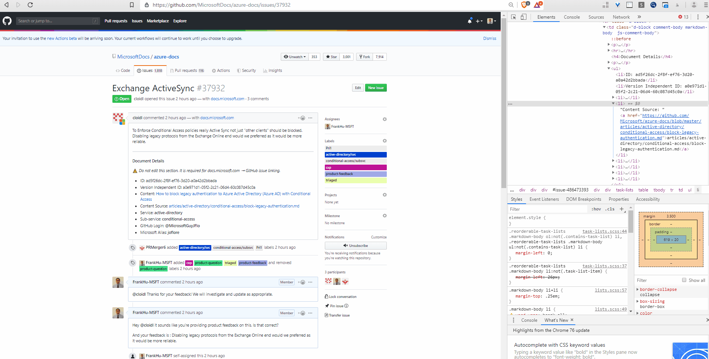
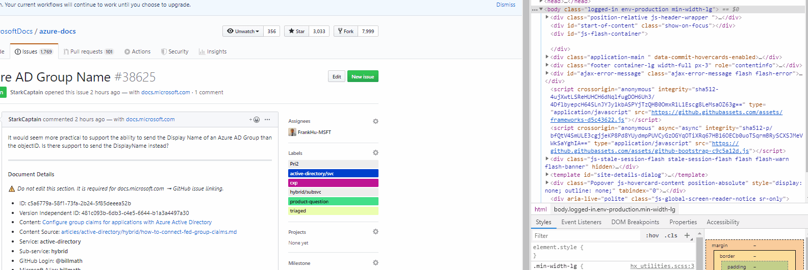

# Replace-Azure-Doc-URLs-Extension
This extension is currently a WIP. This will modify all the URLs with azure-docs and change it to azure-docs-pr

All the related chrome extension files can be found in : https://github.com/FrankHu-MSFT/Replace-Azure-Doc-URLs-Extension/tree/master/Add%20-PR

All other folders are for files related to creating images or gifs. 

# Usage

This will basically add -pr to the azure doc links. This plugin will only run when you are on a github issue URL. 

It basically utilizes some regex to find and replace the azure-docs and adds the -pr to the link.

It also changes the edit pen button on the azure-docs page. 

# Chrome Store Plugin Link
https://chrome.google.com/webstore/detail/add-pr/lglkecaehnimhnaefbnienkembookfbo

# Known Issues
There is a 1 minute grace period you can access the loaded page and for the injection to work properly. After actually bringing the tab into focus, the injection will work properly. 

Otherwise if you don't bring the page into focus, it won't make the change to the html. 

I think it might be due to the fact I'm using JQuery and jquery might need the page to actually be accessed before running properly. So you may need to wait 1 second for the injection to change the azure-docs-pr part. Otherwise just reload the page. Or it might be because unless you actually bring the page into focus, Github doesn't actually load the page. 

# Support 
If there are any issues in regards to this sample, please file a GitHub issue. This sample is not supported by Azure Support or Microsoft.
